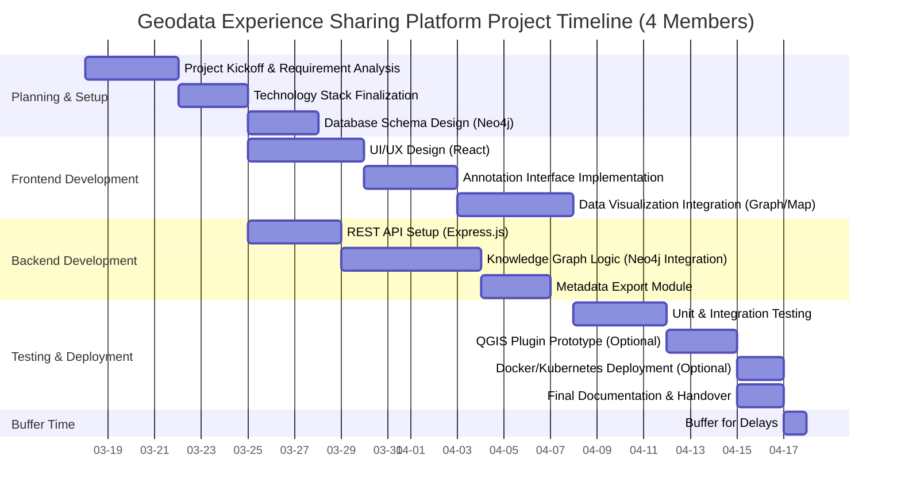

# Geodata-Experience-Sharing-Platform

```mermaid
gantt
    title Geodata Experience Sharing Platform Project Timeline (4 Members)
    dateFormat  YYYY-MM-DD
    axisFormat  %m-%d

    section Planning & Setup
    Project Kickoff & Requirement Analysis       :a1, 2024-03-18, 4d
    Technology Stack Finalization               :a2, after a1, 3d
    Database Schema Design (Neo4j)              :a3, after a2, 3d

    section Frontend Development
    UI/UX Design (React)                        :b1, 2024-03-25, 5d
    Annotation Interface Implementation         :b2, after b1, 4d
    Data Visualization Integration (Graph/Map)  :b3, after b2, 5d

    section Backend Development
    REST API Setup (Express.js)                 :c1, 2024-03-25, 4d
    Knowledge Graph Logic (Neo4j Integration)   :c2, after c1, 6d
    Metadata Export Module                      :c3, after c2, 3d

    section Testing & Deployment
    Unit & Integration Testing                  :d1, 2024-04-08, 4d
    QGIS Plugin Prototype (Optional)            :d2, after d1, 3d
    Docker/Kubernetes Deployment (Optional)     :d3, after d2, 2d
    Final Documentation & Handover              :d4, 2024-04-15, 2d

    section Buffer Time
    Buffer for Delays                           :e1, 2024-04-17, 1d
```
