# 🌍 GeoFeedback Platform - Geographic Data Feedback and Knowledge Management Platform

[](https://opensource.org/licenses/MIT)
[](https://neo4j.com/)
[](https://react.dev/)
[](https://expressjs.com/)

**A collaborative platform for geographic data with knowledge graphs and AI assistance**  
Submit feedback, visualize relationships, and get AI-powered insights for geographic datasets.

---

## 📋 Table of Contents
- [🌍 GeoFeedback Platform - Geographic Data Feedback and Knowledge Management Platform](#-geofeedback-platform---geographic-data-feedback-and-knowledge-management-platform)
  - [📋 Table of Contents](#-table-of-contents)
  - [🌟 Core Features](#-core-features)
  - [🛠️ Technical Architecture](#️-technical-architecture)
  - [🚀 Quick Start](#-quick-start)
  - [🗺️ Usage Guide](#️-usage-guide)
    - [1. **Authentication** 🔑](#1-authentication-)
    - [2. **Submit Feedback** 📤](#2-submit-feedback-)
    - [3. **Explore Data** 🔍](#3-explore-data-)
    - [4. **Export Data** 📥](#4-export-data-)
  - [⚙️ Configuration](#️-configuration)
  - [📆 Gantt Diagram](#-gantt-diagram)
  - [🆘 Support](#-support)
  - [📜 License](#-license)

---

## 🌟 Core Features

| Feature                | Description                                                                 |  
|------------------------|-----------------------------------------------------------------------------|  
| **📝 Feedback Management** | Submit/browse data feedback with **AI auto-tagging** (GPT-4) and issue tracking. |  
| **🌐 Knowledge Graph**    | Neo4j-powered metadata network for visualizing complex geographic relationships. |  
| **🤖 AI Assistance**      | Natural language Q&A and context-aware metadata suggestions.               |  
| **🔒 Role-Based Access**  | JWT authentication with roles: *Editeur*, *Admin*.              |  

---
## 🛠️ Technical Architecture

```mermaid
%%{init: {'theme': 'base', 'flowchart': {'curve': 'basis'}}}%%
flowchart TD
    Frontend["🖥️ Frontend (React)"] -->|API Calls| Backend["🛠️ Backend (Express.js)"]
    Backend -->|Cypher Queries| Database["🗃️ Database (Neo4j)"]
    Backend -->|API Integration| AI["🤖 AI Service (GPT-4)"]
```



- **Frontend**: React + Material-UI + Recharts  
- **Backend**: Express.js + Neo4j Driver + JWT Auth  
- **Database**: Neo4j 4.4 (Docker deployment)  
- **AI Service**: OpenAI GPT-4 API  
---
## 🚀 Quick Start  

1. **Clone Repository**  
   ```bash
   git clone https://github.com/ENSG-TSI24/Geodata-Experience-Sharing-Platform.git
   cd Geodata-Experience-Sharing-Platform
   ```

2. **Environment Setup**  
   - Create a `.env` file in the root directory with required configurations (e.g., Neo4j credentials, OpenAI API key).  

3. **Docker Deployment**  
   - **First Run or Updates**:  
     ```bash  
     sudo -s  # If permissions are needed  
     docker-compose build --no-cache  # Clean rebuild  
     docker-compose up  # Start services  
     ```  
   - **Subsequent Runs**:  
     ```bash  
     docker-compose up  # Launch existing containers  
     ```  

4. **Access the Platform**  
   - Open your browser and navigate to:  
     ```  
     http://localhost:5000   
     ```  

5. **Stop Services**  
   ```bash  
   docker-compose down --volumes --remove-orphans  # Clean shutdown  
   ```  

---

## 🗺️ Usage Guide  

### 1. **Authentication** 🔑  
   - **Sign Up**:  
     - Click "Register" → Fill in username, password, and email → Verify via email.  
   - **Log In**:  
     - Use credentials to access the platform.  

### 2. **Submit Feedback** 📤  
   - Go to *Feedback* → Attach files (CSV/GeoJSON/Excel) → Add description.  
   - **AI Tags**: GPT-4 generates tags automatically (e.g., `alignment`, `geometry`).  

### 3. **Explore Data** 🔍 
   - Use the **Knowledge Graph** tab to:  
     - Visualize metadata connections.  
     - Filter by tags, date, or dataset type.  
   - Example Cypher query for relationships:  
     ```cypher  
     MATCH (d:Dataset)-[r:HAS_ISSUE]->(i:Issue) RETURN d, r, i  
     ```  

### 4. **Export Data** 📥  
   - Select datasets → Choose *Export* → Download as CSV/Excel.  

---

## ⚙️ Configuration  

- **Neo4j Database**: Ensure it runs via Docker (see [Quick Start](#-quick-start)).  
- **Environment Variables** (`.env`):  
  ```  
  NEO4J_URI=bolt://localhost:7687  
  NEO4J_USER=neo4j  
  NEO4J_PASSWORD=your_secure_password  
  OPENAI_API_KEY=sk-your_openai_key  
  ```  

---

---
## 📆 Gantt Diagram

---

## 🆘 Support  

Contact the team by opening an issue on [GitHub](https://github.com/ENSG-TSI24/Geodata-Experience-Sharing-Platform).  

--- 

> **Pro Tip** 💡: Run `docker-compose down --volumes` before major config changes to avoid conflicts!  

---

## 📜 License

[MIT License](https://opensource.org/licenses/MIT)  
Copyright (c) 2025 ENSG-TSI24

---

**Screenshots & Demos**  
  
*Figure: Neo4j-based metadata relationship network*
