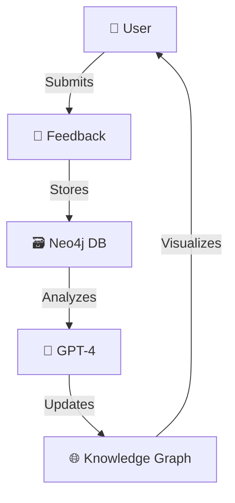

**User Guide** 🌍  
*(Updated for GeoFeedback Platform v2.0)*  

---

### 🚀 Quick Start  

1. **Environment Setup**  
   - Create a `.env` file in the root directory with required configurations (e.g., Neo4j credentials, OpenAI API key).  

2. **Docker Deployment**  
   - **First Run or Updates**:  
     ```bash  
     sudo -s  # If permissions are needed  
     docker-compose build --no-cache  # Clean rebuild  
     docker-compose up  # Start services  
     ```  
   - **Subsequent Runs**:  
     ```bash  
     docker-compose up  # Launch existing containers  
     ```  

3. **Access the Platform**  
   - Open your browser and navigate to:  
     ```  
     http://localhost:5000   
     ```  

4. **Stop Services**  
   ```bash  
   docker-compose down --volumes --remove-orphans  # Clean shutdown  
   ```  

---

### 🌟 Core Features  

| Feature                | Description                                                                 |  
|------------------------|-----------------------------------------------------------------------------|  
| **📝 Feedback Management** | Submit/browse data feedback with **AI auto-tagging** (GPT-4) and issue tracking. |  
| **🌐 Knowledge Graph**    | Neo4j-powered metadata network for visualizing complex geographic relationships. |  
| **🤖 AI Assistance**      | Natural language Q&A and context-aware metadata suggestions.               |  
| **🛠️ QGIS Integration**   | Sync datasets and submit feedback directly via QGIS plugin.                |  
| **🔒 Role-Based Access**  | JWT authentication with roles: *User*, *Admin*, *Researcher*.              |  

---

### 🗺️ Usage Guide  

#### 1. **Authentication** 🔑  
   - **Sign Up**:  
     - Click "Register" → Fill in username, password, and email → Verify via email.  
   - **Log In**:  
     - Use credentials to access the platform.  

#### 2. **Submit Feedback** 📤  
   - Go to *Feedback* → Attach files (CSV/GeoJSON/Excel) → Add description.  
   - **AI Tags**: GPT-4 generates tags automatically (e.g., `alignment`, `geometry`).  

#### 3. **Explore Data** 🔍  
   - Use the **Knowledge Graph** tab to:  
     - Visualize metadata connections.  
     - Filter by tags, date, or dataset type.  
   - Example Cypher query for relationships:  
     ```cypher  
     MATCH (d:Dataset)-[r:HAS_ISSUE]->(i:Issue) RETURN d, r, i  
     ```  

#### 4. **Export Data** 📥  
   - Select datasets → Choose *Export* → Download as CSV/Excel.  

---

### ⚙️ Configuration  

- **Neo4j Database**: Ensure it runs via Docker (see [Quick Start](#-quick-start)).  
- **Environment Variables** (`.env`):  
  ```  
  NEO4J_URI=bolt://localhost:7687  
  NEO4J_USER=neo4j  
  NEO4J_PASSWORD=your_secure_password  
  OPENAI_API_KEY=sk-your_openai_key  
  ```  

---

### ⚠️ Notes  

- **File Requirements**:  
  - Formats: CSV, GeoJSON, Excel.  
  - Max size: **500MB**.  

---

### 🆘 Support  

Contact the team by opening an issue on [GitHub](https://github.com/ENSG-TSI24/Geodata-Experience-Sharing-Platform).  

--- 

> **Pro Tip** 💡: Run `docker-compose down --volumes` before major config changes to avoid conflicts!  

---


*Figure: Platform workflow with AI and Neo4j integration*