# GeoFeedback Platform User Guide 🌍  
*(Version 2.0)*  

---

## 🚀 Quick Start  

### 1. **Environment Setup**  
   - **Step 1**: Create a `.env` file in the `backend` directory with the following configurations:
        ```  
        NEO4J_URI=neo4j_uri
        NEO4J_USER=neo4j  
        NEO4J_PASSWORD=your_secure_password  
        OPENAI_API_KEY=sk-your_openai_key  
        ```  

### 2. **Docker Deployment**  
   - **First Run or Updates**:  
     ```bash  
     sudo -s  # If permissions are needed  
     docker-compose build --no-cache  # Clean rebuild  
     docker-compose up  # Start services  
     ```  
   - **Subsequent Runs**:  
     ```bash  
     docker-compose up  # Launch existing containers  
     ```  

### 3. **Access the Platform**  
   - Open your browser and navigate to:  
     ```  
     http://localhost:5000   
     ```  

### 4. **Stop Services**  
    ```bash  
    docker-compose down --volumes --remove-orphans  # Clean shutdown  
    ```  

---

## 🌟 Core Features  

| Feature                | Description                                                                 |  
|------------------------|-----------------------------------------------------------------------------|  
| **📝 Feedback Management** | Submit/browse data feedback with **AI auto-tagging** (GPT-3) and issue tracking. |  
| **🌐 Knowledge Graph**    | Neo4j-powered metadata network for visualizing complex geographic relationships. |  
| **🤖 AI Assistance**      | Natural language Q&A and context-aware metadata suggestions.               |  
| **🔒 Role-Based Access**  | JWT authentication with roles: *Editeur*, *Admin*.              |  

---

## 🗺️ Usage Guide  

#### 1. **Authentication** 🔑  
   - **Sign Up**:  
     - Click "Register" → Fill in username, password, and email → Verify via email.  
     - 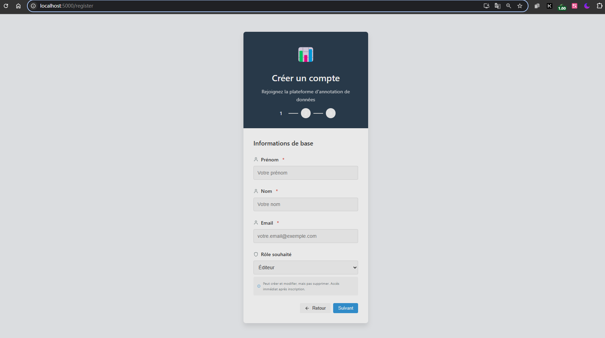
     - 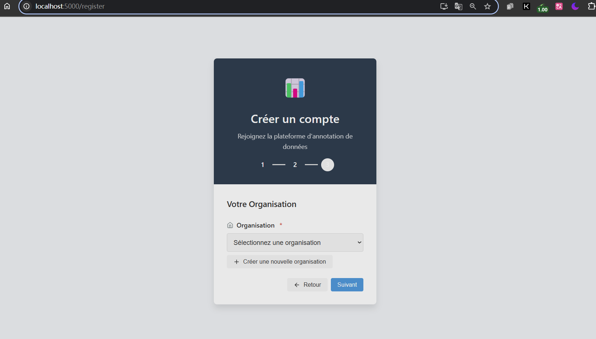
     - 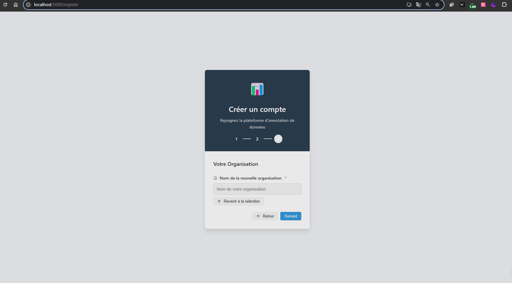
     - 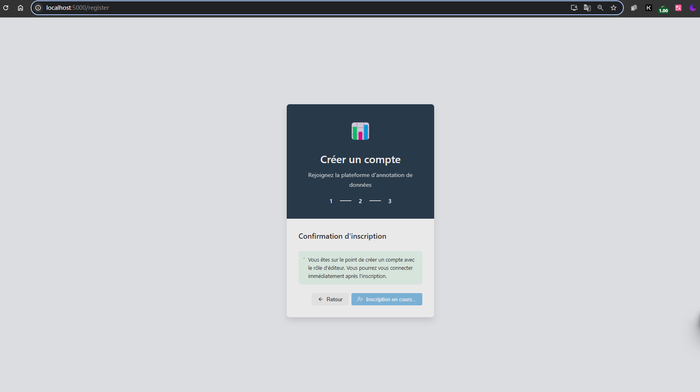
   - **Log In**:  
     - Use credentials to access the platform.  
     - 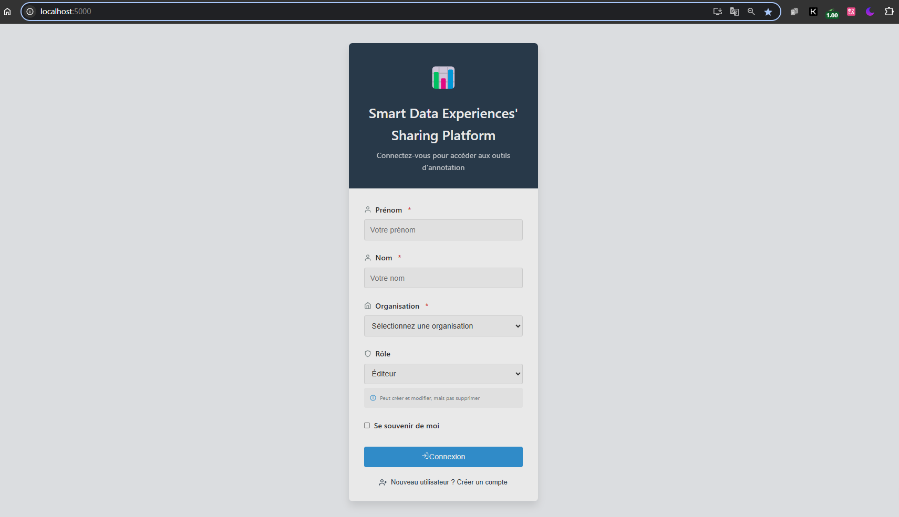

   - Here we are **Main Page** 🏠  
     - 

#### 2. **Chatbot** 📤    
   - **Chat**: Interact with the chatbot for context-aware suggestions.
   - **Feedback**: Submit feedback with tags and comments.
   - **AI Tags**: GPT-3 generates tags automatically (e.g., `alignment`, `geometry`). 
   - 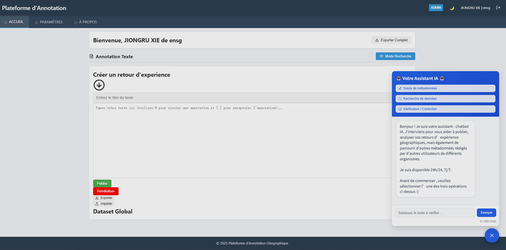 

#### 3. **Export Data** 📥  
   - Select datasets → Choose *Export* → Download as .JSON.  
   - 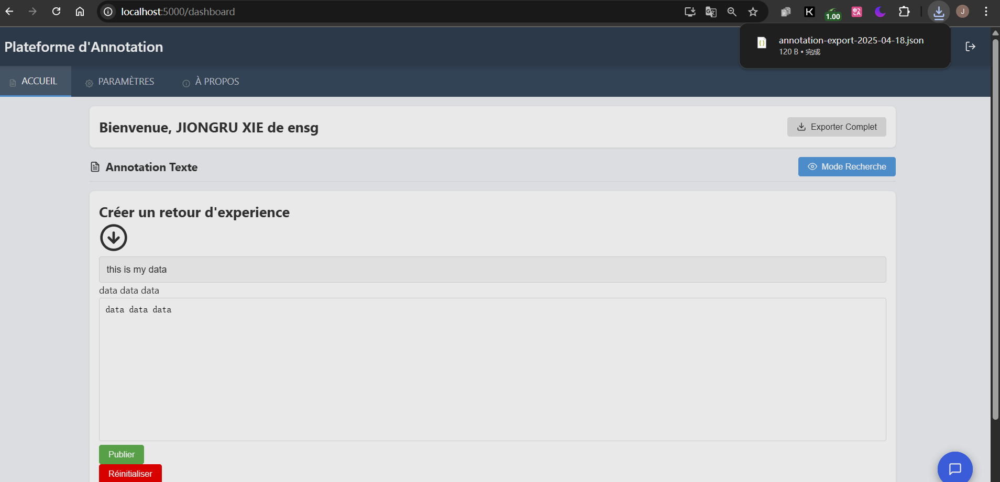

#### 4. **Semantic Analysis** 📈
  - **Word Cloud**: Visualize feedback tags.  

  - **Data Description**: Dataset descriptions.
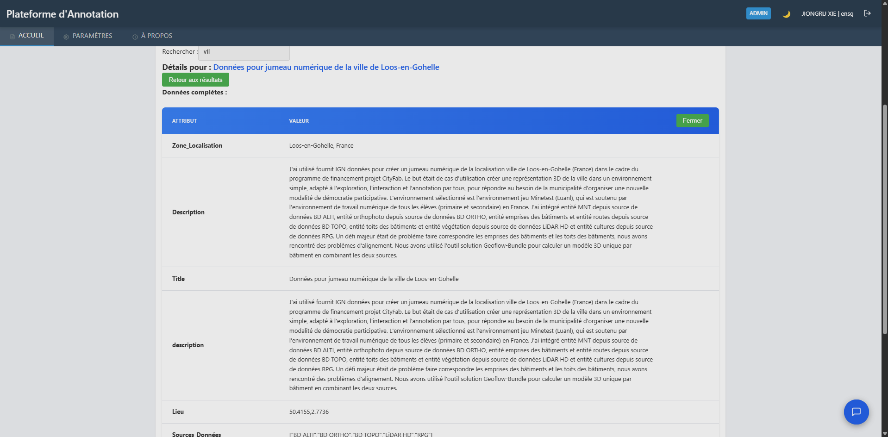
  - **Comment**: Comments to feedback.
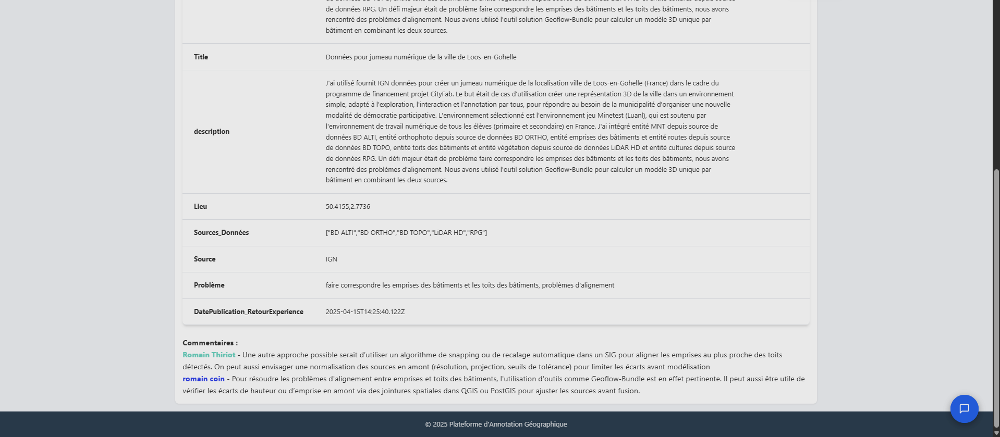

#### 5. **Data viasualization by Map** 🗺 
  - **Map**: Interactive map for data visualization.
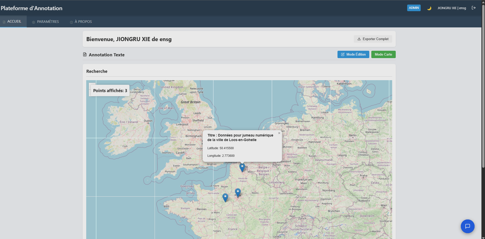

#### 6. **Comment** 💬
- **Comment with annotation**: Comment with annotation,by tape "#"
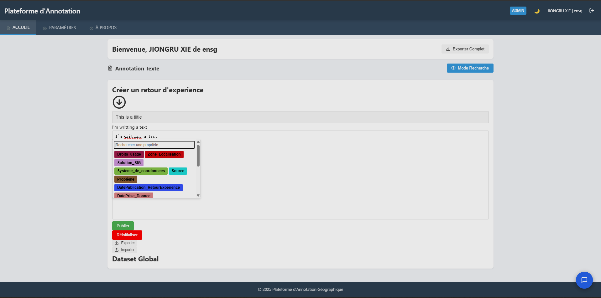
  


#### 7. **Role Management** 🔑
- **Permission**: Manage user roles and permissions.(Administrator only)
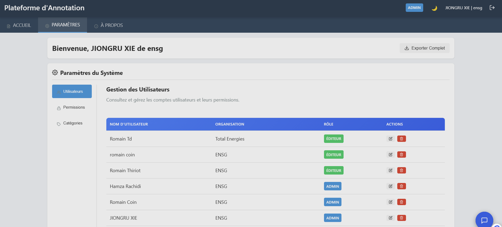
- **Approval**: Approve upgrades.
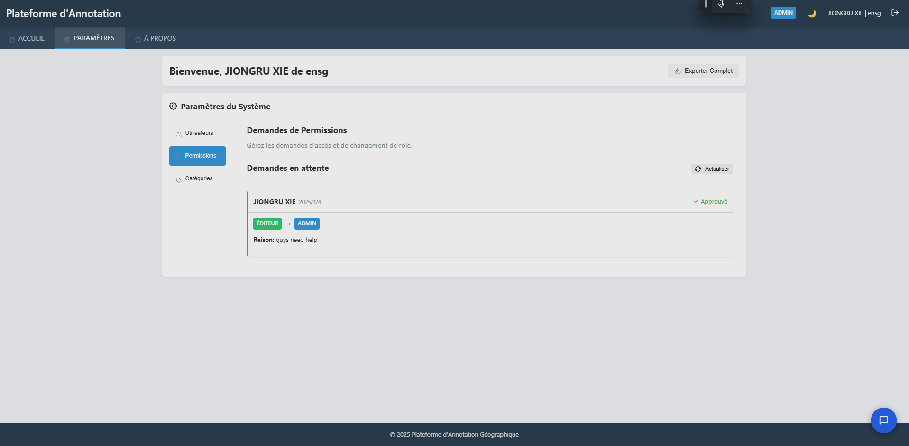

#### 8. **Dark Mode** 🌙
- **Dark Mode**: Switch between light and dark themes.
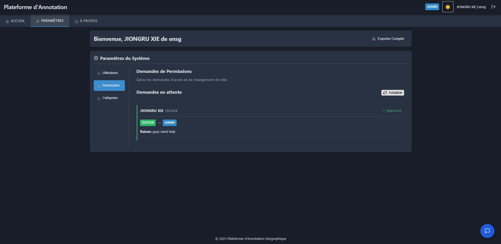
---
### 🆘 Support  

Contact the team by opening an issue on [GitHub](https://github.com/ENSG-TSI24/Geodata-Experience-Sharing-Platform).  

--- 

> **Pro Tip** 💡: Run `docker-compose down --volumes` before major config changes to avoid conflicts!  
